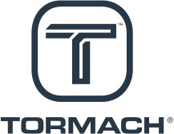

<h1 align="center">EtherlabMaster for Tormach PathPilot</h1>

<div align="center"></div>
<div align="center"></div>

<h4 align="center">IgH Ethercat Master for <i>real-time</i> Linux kernel.</h4>

<p align="center">
<a href="https://forums.tormach.com" target="_blank">

</a>
</p>

<p align="center">
<a href="https://tormach.com/">Tormach</a>
|
<a href="https://etherlab.org/en/ethercat/index.php">EtherLab</a>
|
<a href="https://pathpilot.com">PathPilot</a>
</p>

**Tormach Etherlab master** is a fork of _IgH EtherCAT Master for Linux_ project from [EtherLab](https://etherlab.org/en/ethercat/index.php) supplemented with community supplied patches and internal development.


## Getting started

The easiest and preferred way how to install the EtherLAb EtherCAT master software on a Debian system is to use the prepared packaging recipes. This will require a system some with pre-installed packages as specified in the official Debian [Building Tutorial](https://wiki.debian.org/BuildingTutorial). Then you will need to execute a sequence of commands similar to:

```sh
git clone https://github.com/tormach/etherlabmaster.git
cd etherlabmaster
mk-build-deps -irs sudo
dpkg-buildpackage -us -uc -b
```

Or when using Docker container as an isolated builder (simplified and dismissive about file permissions):

```sh
docker run -it --rm -v "$(pwd):/tec" -v "/usr/lib/systemd:/usr/lib/systemd" debian:bullseye bash -i
apt-get update
apt-get install build-essential fakeroot devscripts
cd /tec
mk-build-deps -ir
dpkg-buildpackage -us -uc -b
mv ../*.deb .
mv ../*.buildinfo .
mv ../*.changes .
```

The packaging is made to use the _**D**ynamic **K**ernel **M**odule **S**upport_ ([DKMS](https://github.com/dell/dkms)), this means that the compilation process is twofold. One part happens when building the binary Debian packages (mainly libraries), but the second part happens when the package is actually installed on the system via the `apt` command (or its sisters).

But this information is important mainly for those wanting to develop the software, for users it should be hidden and the installation process should take care of everything automatically.


## Frequently asked questions

|| What is _**EtherCAT**_? |
|:---:|---|
|| **EtherCAT** is an industrial fieldbus invented by Beckhoff Automation. It is based on Ethernet to reduce hardware costs and simplify the deployment. It excels for low cycle times of 100 μs and low communication jitter. |

|| Where can I find more information about EtherLab EtherCAT master? |
|:---:|---|
|| The upstream project has its own [_**F**requently **A**sked **Q**uestions page_](https://etherlab.org/en/ethercat/faq.php) and manual available in [_PDF_](https://etherlab.org/download/ethercat/ethercat-1.5.2.pdf) format. The community extensions and patches have no documentation beyond what is available in the codebase. |

|| How does this fork differ from upstream IgH EtherCAT master or other forks? |
|:---:|---|
|| Only the _**generic**_ networking driver running on **x86-64** (_amd64_) _**RT_Preempt**_ real-time Linux patch are considered _a must_ for this project. Also, the packaging for Debian distro and its derivatives (_.deb_ files) are maintained. Everything else is maintained and developed on a **best effort basis**. |

## Getting involved

The main imperative of this project is to provide EtherCAT master for Tormach machines and PathPilot software. Complying with this requirement, **contributions** are welcome, and **pull requests** are **accepted**.

Contributors should test their code on any and all hardware devices they have at their disposal before opening the pull request to avoid unnecessary complications.

Problems and ideas with the EtherCAT master should be discussed on Github Issue tracker.

|| It's always encouraged to create a new _issue_ in GitHub tracker first. Discuss the proposed changes there and then based on the output implement the changes and create a new _pull request_. |
|:---:|---|

## Licence

This software is released under the **GPLv2**. The code is intellectual property of various authors. This repository is publicly distributed in hopes that it will be useful for others but **WITHOUT ANY WARRANTY**, without even the implied warranty of **MERCHANTABILITY** or **FITNESS FOR A PARTICULAR PURPOSE**.


## Original README

------------------------------------------------------------------------------

This is the README file of the IgH EtherCAT Master.

$Id$

vim: spelllang=en spell tw=78

------------------------------------------------------------------------------

Contents:
1) General Information
2) Requirements
3) Building and installing
4) Realtime & Tuning
5) License
6) Coding Style

------------------------------------------------------------------------------

1) General Information
======================

This is an open-source EtherCAT master implementation for Linux 2.6.

See the FEATURES file for a list of features. For more information, see
http://etherlab.org/en/ethercat.

or contact

Dipl.-Ing. (FH) Florian Pose <fp@igh-essen.com>
Ingenieurgemeinschaft IgH
Heinz-Baecker-Str. 34
D-45356 Essen
http://igh-essen.com

------------------------------------------------------------------------------

2) Requirements
===============

1) Software requirements

Configured sources for the Linux 2.6 kernel are required to build the EtherCAT
master.

2) Hardware requirements

A table of supported hardware can be found at
http://etherlab.org/en/ethercat/hardware.php.

------------------------------------------------------------------------------

3) Building and installing
==========================

See the INSTALL file.

------------------------------------------------------------------------------

4) Realtime & Tuning
====================

Realtime patches for the Linux kernel are supported, but not required. The
realtime processing has to be done by the calling module (see API
documentation). The EtherCAT master code itself is passive (except for the
idle mode and EoE).

To avoid frame timeouts, deactivating DMA access for hard drives is
recommended (hdparm -d0 <DEV>).

------------------------------------------------------------------------------

5) License
==========

Copyright (C) 2006-2009  Florian Pose, Ingenieurgemeinschaft IgH

This file is part of the IgH EtherCAT Master.

The IgH EtherCAT Master is free software; you can redistribute it and/or
modify it under the terms of the GNU General Public License version 2, as
published by the Free Software Foundation.

The IgH EtherCAT Master is distributed in the hope that it will be useful, but
WITHOUT ANY WARRANTY; without even the implied warranty of MERCHANTABILITY or
FITNESS FOR A PARTICULAR PURPOSE. See the GNU General Public License for more
details.

You should have received a copy of the GNU General Public License along with
the IgH EtherCAT Master; if not, write to the Free Software Foundation, Inc.,
51 Franklin St, Fifth Floor, Boston, MA  02110-1301  USA

---

The license mentioned above concerns the source code only. Using the EtherCAT
technology and brand is only permitted in compliance with the industrial
property and similar rights of Beckhoff Automation GmbH.

------------------------------------------------------------------------------

6) Coding Style
===============

Developers shall use the coding style rules in the CodingStyle.txt file.

------------------------------------------------------------------------------
